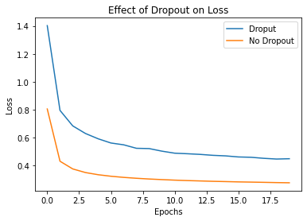
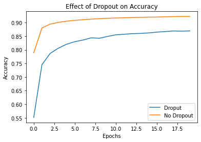

# Implementing Dropout

This repository provides code for the medium article *quote and link the article*. The article introduces dropout and demonstrates the effects of dropout on the training of a neural network using Keras.

## Setup and Execution
Install necessary Python packages using below commands.
* `pip install numpy matplotlib`
* `pip install --upgrade tensorflow`
* `pip install Keras`

After installing the packages using the above commands, open the  `implementing-dropout.ipynb` file and run all the cells.

## Results

